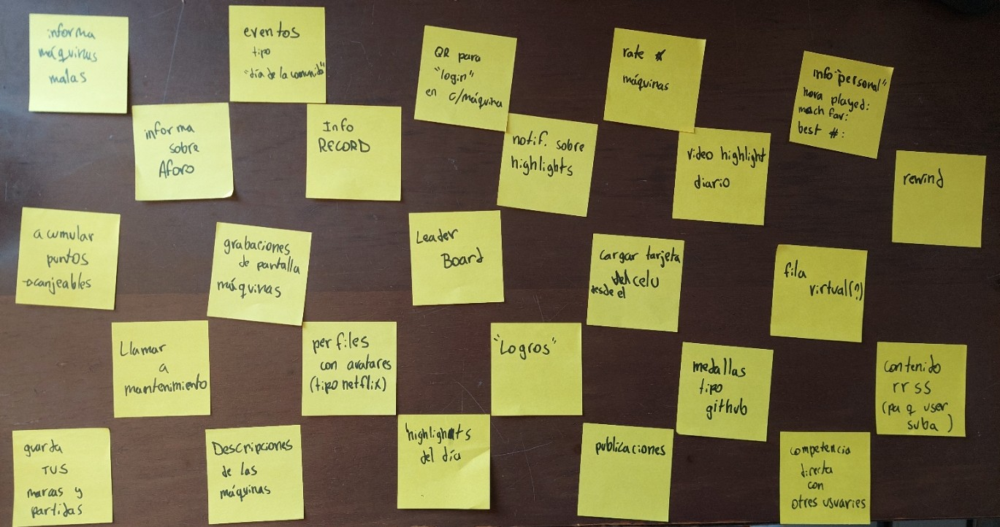
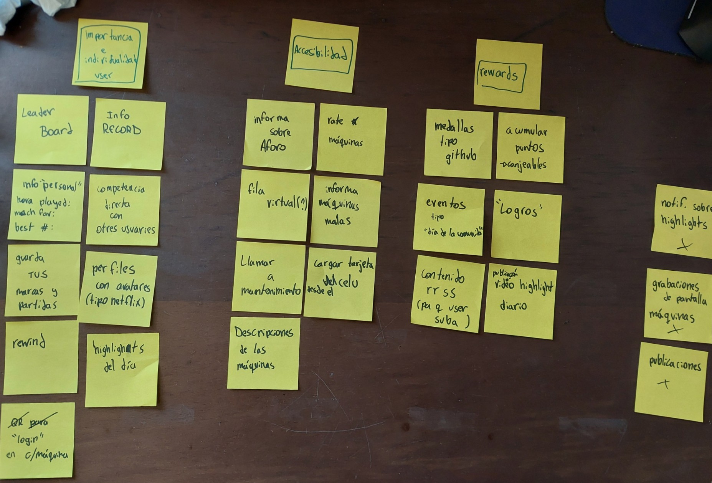

# defining user problems

## intro to define phase

preguntas guía:

- Which of my users’ needs or problems are the most important ones for my design to address? 

- How might my design address these needs or problems in effective and unique ways that create value for users?

### problem statement

una frase que resume **quién** es el usuario, **qué** necesitan, y  por **qué**.

[Name of user persona] is a [type of user] who needs [type of user experience] because [benefits of user experience].

-Human-centered
- Broad enough for creative freedom
- Narrow enough to be solved by a practical design solution

### hypothesis statements

una frase que ayuda en la transición entre la definición de problemas, hacia la ideación de soluciones.

If [user] can perform [action], then they will achieve [benefit].

must:
- Determine an action that could solve your user’s need.
- Specify the outcome that you expect from the action.

### hypothesis statements

if ______ then ________

if jere downlaods this app, then he would be able to reserve his class beforehand

"Empathizing with users allows you to consider the product experience from the users’ perspective. By connecting with people directly, like through interviews, you can discover and understand users' likes, dislikes, and pain points. 

Then, sort through research you collected about users to define the problem they're facing. Creating a problem statement helps you clearly define the user pain points that your future designs can address. 

You might encounter situations where you have multiple hypothesis statements for one problem statement. That’s okay! " [cita](https://www.coursera.org/learn/start-ux-design-process/supplement/h0z9K/define-hypothesis-statements)

### resumen
Hypothesis Statement: A hypothesis statement communicates the designer’s educated guess about how to address the user need identified in the problem statement, often framed in an if/then format.
Human-Centered Design: Design that prioritizes the needs and experiences of users, ensuring that solutions are relevant and effective.
Actionable Insight: An insight that provides a clear direction for design solutions, helping designers understand the 'why' behind user needs.
Problem Statement: A problem statement describes a user need that the product must address, focusing on the user's characteristics and the actionable insights behind their needs.

Problem statement template
A problem statement can be written with this process: 

Start with the name of a user persona

Add a short description of the user’s characteristics 

Clearly describe the user’s need

Explain why the user has that need

The reason for the need (the “why”) should be an actionable insight that the designer can address in their design. 

This process should yield a problem statement that more or less fits this template:

[User name] is a/an [user characteristics] who needs [user need] because [insight].

plantilla: [aquí](https://docs.google.com/presentation/d/1k5jr9ejf_oIXAz1cBqNi-X-x7uQzzrQN0O6Quafp6p8/edit?slide=id.gc4c7ebb755_0_124#slide=id.gc4c7ebb755_0_124)

ask yourself these questions:

Have you constructed a problem statement that is:

Human-centered and focused on the needs of a specific persona?

Broad enough for creative freedom?

Narrow enough to be solved by a practical design solution?

Based on your problem statement, does your hypothesis statement establish:

The specific action that your solution should enable the user to do or achieve?

The desired outcome that determines whether your solution was successful in meeting the user’s need?

### value propositions

resumen y destacan cóomo un producto en específico es valioso para les usuaries, y cómo se diferencia de otros productos.

To create a value proposition, designers typically answer these key questions:

- What does the product do? Here, designers clearly state the key actions the product enables users to perform or the key benefits it enables them to achieve.

- Why should the user care? Here, designers emphasize how their product addresses users’ pain points in unique ways that aren’t offered by other products.

Step 1. Describe your product’s features and benefits. Create a list of all the great features and benefits of your product, big and small. Don’t hold back; list everything that comes to mind and then narrow it down later.

Step 2. Explain the value of the product. Anything that you identify as a value proposition needs to be beneficial to your users. In this example, for the dog walker app, there were four categories of product values that were identified during user interviews: accessible, professional experience of the dog walkers, cost, and reliability. The giant list of features and benefits from step one is sorted into those four categories

